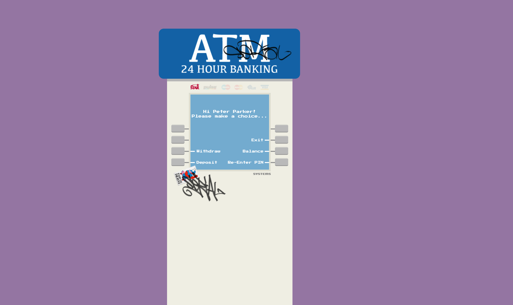

# React + TypeScript + Vite

### Built With

The technologies used to build this project include:

* [![TypeScript][TypeScript]][typescript-url]
* [![React][React.js]][React-url]
* [![Tanstack Query][tanstack.com]][tanstack-url]
* [![CSS][css-tricks.com]][css-url]

For Tanstack Query this is the list of support for Browsers

* [![Chrome][Chrome]][Chrome-url] >= 91
* [![Firefox][Firefox.com]][Firefox-url] >= 90
* [![Edge][Edge.com]][Edge-url] >= 91
* [![Safari][Safari.com]][Safari-url] >= 15
* [![Ios][Ios.com]][Ios-url] >= 15
* [![Opera][Opera.com]][Opera-url] >= 77

### Installation

The instalation is a simple process, just clone the repository and follow this guide

1. Clone the repo
   ```sh
   git clone https://github.com/jijimenezf/atm-machine-web.git
   ```
2. Install NPM packages
   ```sh
   npm install
   ```
3. In order to have both BE and FE servers and submit request to an API endpoint, you need to run
   ```sh
   npm run start
   ```
   That task has the configuration for running both, FE and BE servers.

4. If you only run this command
   ```sh
   npm run dev # only FE dev server
    ```

   Only the FE dev server would be available and the data won't be displayed.


4. I did not include a NodeJS + Express server configuration because I found json-server library so I decided to include it in this project. There are other options, like a DataBase Cloud server but more time is required in order to achieve it.

If you have any doubt, please reachme at jijimenezf@hotmail.com.
Thanks!

# Casetext Homework Assignment
Your task in this challenge is to build a demo web app that is a functional ATM machine. Please use a stubbed backend as if you were interacting with a server (ie reading from a file or local storage). Feel free to add any bells and whistles you’d like.

## Guidelines:
- Please work in React, using Javascript or Typescript, and utilize any additional frameworks or libraries as needed.
- Incorporate state management effectively in your application.
- Utilize React hooks for managing state and side effects.
- Match the provided mocks as closely as possible.
- Please use provided assets.
- A user should be able to check their balance, withdraw funds, and deposit funds after entering their PIN at a minimum.
- Funds should be correctly reflected after a deposit or withdrawal.
- A user's card type should be highlighted once they have entered their correct PIN.
- Please put your code up on your GitHub account.
- Please include instructions about how we can run your app. (If your solution works better in one browser over the others, let us know which one.)

## Optional:
- While a backend is not required for this assignment, if you feel like it will help you, please create one. You may consider setting up a NodeJS backend server with Express to handle all transactions on the server.

## Mocks:




<!-- MARKDOWN LINKS & IMAGES -->

[React.js]: https://img.shields.io/badge/React-20232A?style=for-the-badge&logo=react&logoColor=61DAFB
[React-url]: https://reactjs.org/
[TypeScript]: https://img.shields.io/badge/TypeScript-0769AD?style=for-the-badge&logo=TS&logoColor=white
[typescript-url]: https://www.typescriptlang.org/docs/handbook/intro.html
[tanstack.com]: https://img.shields.io/badge/TanstackQuery-FF2D20?style=for-the-badge&logo=query&logoColor=white
[tanstack-url]: https://tanstack.com/query/docs
[css-tricks.com]: https://img.shields.io/badge/CSS%203-563D7C?style=for-the-badge&logo=css&logoColor=white
[css-url]: https://css-tricks.com/
[Chrome]: https://img.shields.io/badge/Chrome-35495E?style=for-the-badge&logo=google&logoColor=4FC08D
[Chrome-url]: https://google.com
[Firefox.com]: https://img.shields.io/badge/Firefox-FF2D20?style=for-the-badge&logo=firefox&logoColor=white
[Firefox-url]: https://laravel.com
[Edge.com]: https://img.shields.io/badge/Edge-0769AD?style=for-the-badge&logo=microsoft&logoColor=white
[Edge-url]: https://www.microsoft.com 
[Safari.com]: https://img.shields.io/badge/Safari-0769AD?style=for-the-badge&logo=apple&logoColor=white
[Safari-url]: https://apple.com 
[Opera.com]: https://img.shields.io/badge/Opera-DD0031?style=for-the-badge&logo=opera&logoColor=white
[Opera-url]: https://opera.com
[Ios.com]: https://img.shields.io/badge/iOS-4A4A55?style=for-the-badge&logo=apple&logoColor=FF3E00
[Ios-url]: https://apple.com
